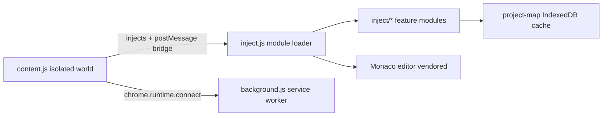

# Cognigy Copilot Chrome Extension

[](https://github.com/TheHenkelmann/cognigy-copilot-chrome-extension/actions/workflows/ci.yml)
[](https://app.codecov.io/gh/TheHenkelmann/cognigy-copilot-chrome-extension/components/lib)
[](https://app.codecov.io/gh/TheHenkelmann/cognigy-copilot-chrome-extension)
[](LICENSE)

Chrome extension for [Cognigy.AI](https://www.cognigy.com/) — flow visualization, naming standards, integrity checks, release tooling, and JSON code view embedded directly in the Cognigy UI.

## Features

### Flow Copilot

- **GoTo / Execute connections** — visualizes links between GoTo and Execute Flow nodes and their target nodes (blue overlay within the same flow; badges on target nodes for incoming jumps from other flows)
- **Nodes recolored by functional group** — background and shape colors in the chart:
  - **Gray** — Debug, Log, Placeholder (subtle)
  - **Slate gray** — Utils (Profile, Context, Analytics, Goals, Ratings, Transcript, Agent Availability, Handover, Search Extract Output)
  - **Purple** — Integration / technical (HTTP Request, Email, Code)
  - **Yellow** — Flow-control branches (Then, Else, Case, Default, On First Execution, Afterwards; If / Switch / Once as yellow SVG shapes)
  - **Green** — Flow control (Start, End, GoTo, Execute Flow, Stop, Sleep, Think, Wait, Trigger Function)
  - **Orange** — Responses (Say, Question, Optional Question, On Question, On Answer, Datepicker)
  - **Blue** — AI / Agents (LLM Prompt, AI Agent Job, Tool Answer; generally nodes whose type contains `ai`, `agent`, or `llm`)

### Naming Convention

- Automatically renames nodes according to the [Naming Convention](#naming-convention) (prefix rules per node type, including `GT_` / `GTW_` / `EX_` for GoTo and Execute Flow)
- Automatically fills analytics steps (`node_` prefix, sanitized)
- **Exception:** Code nodes labeled **"Emit"** are neither renamed nor given an analytics step

### Flow Integrity Check / Auto Bug Recognition

- Detects **[47 bug patterns](#bug-patterns)** at project and flow level (empty configs, dead paths, missing LLM/connection references, extension structure, GoTo/Execute targets, and more)
- Integrity panel in the flow editor (FAB) with severity tabs, auto-fix, dismiss rules, and deep links to affected nodes

### Release Tooling

- **Check tab** — release gate before building:
  - Hard refresh of all flows and nodes from the server
  - Check for errors, warnings, and info messages (excluding naming)
  - Naming convention check with optional Autofix All
  - Run all playbooks in batches of 100 in parallel and wait for task completion
- **Annotate tab** — release name, commit message (max. 500 characters), flow diff against the last snapshot (Monaco side-by-side)
- **Build tab** — create snapshot → package → generate download link → start download; store release metadata locally

### Diff Viewer

- Compares the **current editor state** with **locally stored release snapshots** from release tooling
- Flow list with status (added / removed / changed), Monaco diff editor, snapshot picker in the sidebar

### Code Display

- Additional **Code** tab in the flow editor
- Shows the flow as **structured JSON** in execution order (read-only Monaco)

## Naming Convention

The naming engine (`inject/naming/naming-engine.js`) applies one of three rules per node type (see table below).

**GoTo execution modes:** `executionMode === "continue"` → `GT_`; otherwise → `GTW_`. Execute Flow always uses `EX_`. Self-references use `[SELF]`.

**Analytics steps** are derived from the node label (`node_` + sanitized label, max. 128 characters). Then/Else inherit context from the parent If label.

Non-Cognigy extension nodes (extension package not starting with `@cognigy/`) always use the **extension** rule below, regardless of node type.

**Exception:** Code nodes labeled **"Emit"** are skipped entirely (no rename, no analytics step).

### Rule types

| Rule | Meaning |
| ---- | ------- |
| **prefix** | `PREFIX_Description` — strips Cognigy default names and legacy `:` / `.` delimiters |
| **static** | Fixed label regardless of config |
| **custom** | Computed from node config (see Result column) |

### Node type mapping

| Node type | Rule | Prefix / static value | Result |
| --------- | ---- | --------------------- | ------ |
| `activateProfile` | prefix | `aPP` | `aPP_Description` |
| `addToContext` | prefix | `aCC` | `aCC_Description` |
| `afterwards` | prefix | `after` | `after_Description` |
| `aiAgentHandover` | custom | tool handler | `T_{toolId}` |
| `aiAgentJob` | prefix | `Agent` | `Agent_Description` |
| `aiAgentJobDefault` | static | — | `T_default` |
| `aiAgentJobTool` | custom | tool handler | `T_{toolId}` |
| `aiAgentToolAnswer` | prefix | `RTA` | `RTA_Description` |
| `case` | custom | case handler | `C_{caseValue}` |
| `checkAgentAvailability` | static | — | `checkAgentAvailability` |
| `code` | prefix | `Code` | `Code_Description` (except label `Emit`) |
| `completeGoal` | custom | goal handler | `CG_{goal}` |
| `datePicker` | prefix | `Date` | `Date_Description` |
| `deactivateProfile` | prefix | `dPP` | `dPP_Description` |
| `debugMessage` | prefix | `🐞` | `🐞_Description` |
| `default` | static | — | `C_default` |
| `deleteProfile` | prefix | `rmPP` | `rmPP_Description` |
| `detectLanguage` | prefix | `Lang` | `Lang_Description` |
| `else` | custom | then/else handler | `Else` (analytics derived from parent If) |
| `emailNotification` | prefix | `MAIL` | `MAIL_Description` |
| `end` | custom | start/end handler | `End_{flowName}` |
| `executeFlow` | custom | goto/execute handler | `EX_[FlowName]` or `EX_[SELF]`, optional target node label |
| `extensions` | prefix | `EXT` | `EXT_Description` |
| `extension` | prefix | `EXT` | `EXT_Description` (any non-`@cognigy/` extension node) |
| `getTranscript` | prefix | `getT` | `getT_Description` |
| `goTo` | custom | goto/execute handler | `GT_` / `GTW_[FlowName]` or `[SELF]`, optional target node label |
| `handoverToAgent` | prefix | `HO` | `HO_Description` |
| `httpRequest` | prefix | `HTTP` | `HTTP_Description` |
| `if` | custom | if handler | `If` or `If_{condition}` |
| `json` | prefix | `JSON` | `JSON_Description` |
| `llmEntityExtract` | prefix | `LLMEE` | `LLMEE_Description` |
| `llmPromptDefault` | static | — | `T_default` |
| `llmPromptTool` | custom | tool handler | `T_{toolId}` |
| `llmPromptV2` | prefix | `LLM` | `LLM_Description` |
| `log` | prefix | `🪵` | `🪵_Description` |
| `mergeProfile` | prefix | `mPP` | `mPP_Description` |
| `onAnswer` | static | — | `On Answer` |
| `onFirstExecution` | prefix | `oFT` | `oFT_Description` |
| `onQuestion` | static | — | `On Question` |
| `once` | prefix | `Once` | `Once_Description` |
| `optionalQuestion` | prefix | `OQ` | `OQ_Description` |
| `overwriteAnalytics` | prefix | `A` | `A_Description` |
| `placeholder` | static | — | `TODO` |
| `question` | prefix | `Q` | `Q_Description` |
| `removeFromContext` | prefix | `rmCC` | `rmCC_Description` |
| `requestRating` | prefix | `Rate` | `Rate_Description` |
| `resetContext` | prefix | `rsCC` | `rsCC_Description` |
| `say` | prefix | `S` | `S_Description` |
| `searchExtractOutput` | prefix | `SEO` | `SEO_Description` |
| `sendEmail` | prefix | `MAIL` | `MAIL_Description` |
| `setRating` | prefix | `Rate` | `Rate_Description` |
| `sleep` | custom | sleep handler | `sleep_{milliseconds}ms` |
| `sqlRunQuery` | prefix | `SQL` | `SQL_Description` |
| `start` | custom | start/end handler | `Start_{flowName}` |
| `stop` | static | — | `Stop and Return` |
| `switch` | prefix | `Lookup` | `Lookup_Description` |
| `then` | custom | then/else handler | `Then` (analytics derived from parent If) |
| `think` | prefix | `Think` | `Think_Description` |
| `trackGoal` | prefix | `TG` | `TG_Description` |
| `triggerFunction` | prefix | `Fn` | `Fn_Description` |
| `updateProfile` | prefix | `uPP` | `uPP_Description` |
| `wait` | static | — | `Wait for Input` |

Source of truth: `NAMING_RULES` in `inject/naming/naming-engine.js`.

## Bug Patterns

The project-map issue detector (`inject/project-map/issues.js`) implements **47 detection rules**. GoTo and Execute Flow checks share the same seven patterns (with prefix `goto_` or `execute_flow_` respectively).

Chart validation in the integrity panel also reports `gotoExecute` (**Error**) and `deadPath` (**Warning**) at runtime (cross-flow view).

Naming convention violations (`naming_convention_violation`, **Info**) are scanned separately and are not counted among the 47 bug patterns.

### Flow structure & configuration


| Pattern                        | Severity | Description                                                                        |
| ------------------------------ | -------- | ---------------------------------------------------------------------------------- |
| `dead_path`                    | Warning  | Nodes unreachable at runtime after a terminator (GoTo, Stop, AI Agent Tool Answer) |
| `duplicate_node_label_in_flow` | Info     | Multiple nodes in the same flow share the same label                               |
| `if_condition_empty`           | Warning  | If node has no condition and no rule comparison                                    |
| `say_node_empty_payload`       | Warning  | Say node has no text, data, or channel payload                                     |
| `code_node_empty`              | Warning  | Active code node has no code content                                               |
| `switch_duplicate_case_value`  | Warning  | Switch has duplicate case values                                                   |


### Context & HTTP


| Pattern                                    | Severity | Description                                  |
| ------------------------------------------ | -------- | -------------------------------------------- |
| `add_to_context_missing_key`               | Error    | Add To Context node has no key               |
| `remove_from_context_missing_key`          | Error    | Remove From Context node has no key          |
| `http_request_missing_url`                 | Error    | HTTP Request has no URL                      |
| `http_request_invalid_payload_json`        | Error    | HTTP Request has invalid JSON payload        |
| `http_request_invalid_headers_json`        | Error    | HTTP Request has invalid headers JSON        |
| `http_request_missing_auth_connection`     | Error    | HTTP Request uses auth but has no connection |
| `trigger_function_invalid_parameters_json` | Error    | Trigger Function has invalid parameters JSON |


### GoTo & Execute Flow


| Pattern                         | Severity | Description                                   |
| ------------------------------- | -------- | --------------------------------------------- |
| `*_missing_flow_node_config`    | Error    | No `config.flowNode` set                      |
| `*_empty_target_flow_reference` | Error    | Empty flow reference                          |
| `*_target_flow_not_found`       | Error    | Target flow does not exist in the project     |
| `*_empty_target_node_reference` | Error    | Empty node reference                          |
| `*_target_node_not_found`       | Error    | Target node does not exist in the target flow |
| `*_self_reference`              | Error    | Node references itself                        |
| `*_target_disabled`             | Error    | Target node is disabled                       |


`*` = `goto` or `execute_flow`

### LLM


| Pattern                            | Severity | Description                                               |
| ---------------------------------- | -------- | --------------------------------------------------------- |
| `llm_reference_missing`            | Error    | LLM slot set but reference missing                        |
| `llm_reference_not_found`          | Error    | LLM reference unknown in the project                      |
| `llm_used_test_failed`             | Error    | Used LLM failed its connection test                       |
| `llm_used_test_inconclusive`       | Error    | Used LLM could not be verified                            |
| `llm_default_missing`              | Error    | LLM-capable nodes exist but no default LLM in the project |
| `llm_unused`                       | Info     | LLM unused (connection test OK)                           |
| `llm_unused_test_failed`           | Warning  | LLM unused, connection test failed                        |
| `llm_unused_test_inconclusive`     | Warning  | LLM unused, connection test inconclusive                  |
| `llm_fallback_reference_missing`   | Error    | Fallback LLM reference missing                            |
| `llm_fallback_reference_not_found` | Error    | Fallback LLM unknown                                      |
| `llm_fallback_test_failed`         | Warning  | Fallback LLM connection test failed                       |
| `llm_fallback_test_inconclusive`   | Info     | Fallback LLM connection test inconclusive                 |
| `llm_connection_not_found`         | Error    | LLM connection does not exist                             |
| `llm_connection_deprecated`        | Error    | LLM connection is deprecated                              |


### Extensions & connections


| Pattern                                   | Severity | Description                                   |
| ----------------------------------------- | -------- | --------------------------------------------- |
| `extension_missing_required_config_field` | Error    | Required extension config field missing       |
| `extension_unexpected_child_slots`        | Warning  | Unexpected child slots in extension container |
| `extension_missing_child_slot`            | Warning  | Expected child slot missing                   |
| `extension_surplus_child_node`            | Warning  | Surplus child node                            |
| `extension_unexpected_child_node`         | Warning  | Unexpected child node                         |
| `extension_force_child_active`            | Warning  | Child node forced active                      |
| `extension_node_type_not_registered`      | Error    | Extension node type not registered            |
| `extension_connection_type_unavailable`   | Error    | Connection type unavailable for extension     |
| `extension_connection_removed`            | Error    | Referenced connection removed                 |
| `extension_connection_deprecated`         | Error    | Referenced connection deprecated              |
| `extension_connection_type_mismatch`      | Error    | Connection type does not match extension      |


### AI Agent


| Pattern                                 | Severity | Description                           |
| --------------------------------------- | -------- | ------------------------------------- |
| `ai_agent_tool_answer_missing_or_empty` | Error    | AI Agent Tool Answer missing or empty |


### Chart validation (integrity panel)


| Pattern       | Severity | Description                                                                            |
| ------------- | -------- | -------------------------------------------------------------------------------------- |
| `gotoExecute` | Error    | GoTo or Execute Flow references a missing target flow or node (cross-flow chart check) |
| `deadPath`    | Warning  | Dead path nodes after terminating nodes in the current flow (chart check)              |


## Architecture




| Layer                  | Role                                                           |
| ---------------------- | -------------------------------------------------------------- |
| `content.js`           | Injects page scripts, bridges `postMessage` ↔ `chrome.runtime` |
| `inject.js`            | Loads feature modules into the page context                    |
| `inject/naming/*`      | Validation engine, naming, integrity UI, chart overlays        |
| `inject/project-map/*` | Flow topology, issue detection, structured JSON builder        |
| `inject/release/*`     | Release/snapshot UI and Cognigy REST API client                |
| `inject/flow-code/*`   | Code tab, JSON rendering from project map                      |
| `background.js`        | Extension service worker (message routing)                     |


## Supported deployments

Works on Cognigy-hosted and partner-hosted instances:

- `*.cognigy.cloud`
- `*.cognigy.ai`
- `live.ai.telekomcloud.com` (Telekom Cloud partner deployment)

## Install (developer / unpacked)

```bash
git clone https://github.com/TheHenkelmann/cognigy-copilot-chrome-extension.git
cd cognigy-copilot-chrome-extension
npm install
npm run build    # copies Monaco assets → inject/vendor/monaco/
```

1. Open `chrome://extensions`
2. Enable **Developer mode**
3. Click **Load unpacked** and select this directory
4. Open a Cognigy project — the Copilot FAB appears in the flow editor

## Development

```bash
npm run lint          # ESLint
npm run format:check  # Prettier
npm run typecheck     # tsc --checkJs (scoped)
npm run test:coverage # Vitest + coverage
npm run build         # Monaco vendor copy
```

Coverage is split intentionally:


| Scope                                                                     | Role                                            | Gate                                |
| ------------------------------------------------------------------------- | ----------------------------------------------- | ----------------------------------- |
| `lib/**`                                                                  | Extracted, unit-testable core (logger, helpers) | **90 %+** (Codecov component `lib`) |
| `inject/naming/naming-engine.js`, `inject/project-map/structured-json.js` | Pure-logic inject modules                       | Informational only (`inject-core`)  |
| Remaining `inject/**`                                                     | UI / Chrome integration                         | Not in coverage scope               |


See [CONTRIBUTING.md](CONTRIBUTING.md) for details.

## Privacy

- **No telemetry** — the extension does not phone home
- **No third-party backend** — API calls go directly to your Cognigy instance
- Cognigy session tokens are intercepted in-page only to call Cognigy's own REST API on your behalf
- Release snapshots and issue dismissals are stored locally (IndexedDB / `localStorage`)

## Permissions


| Permission                            | Why                                                     |
| ------------------------------------- | ------------------------------------------------------- |
| `storage`                             | Persist settings, cached project data, releases locally |
| `*.cognigy.cloud/*`, `*.cognigy.ai/*` | Inject copilot into Cognigy UI                          |
| `live.ai.telekomcloud.com/*`          | Telekom Cloud Cognigy deployments                       |


## Related projects

- [`cognigy-api-client`](https://github.com/TheHenkelmann/cognigy-api-client) — typed Python SDK for the Cognigy REST API

## License

MIT — see [LICENSE](LICENSE). Cognigy® is a trademark of Cognigy GmbH; this project is community-maintained and not affiliated with Cognigy.

Monaco Editor assets are vendored under MIT — see [THIRD_PARTY_NOTICES.md](THIRD_PARTY_NOTICES.md).